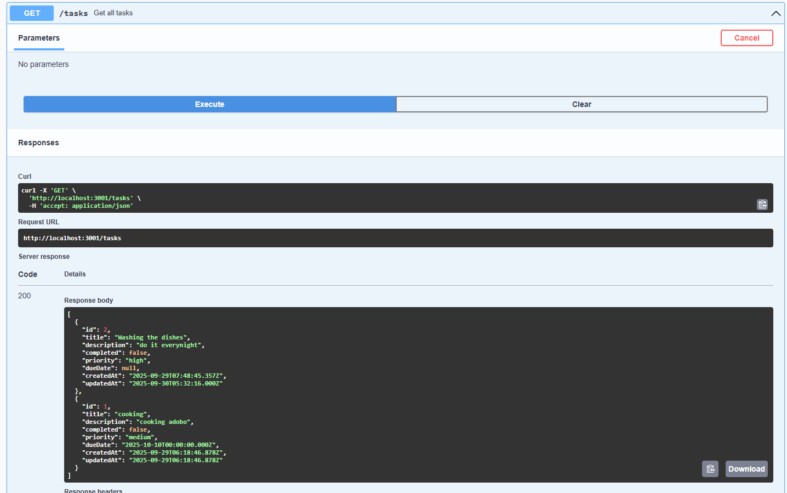
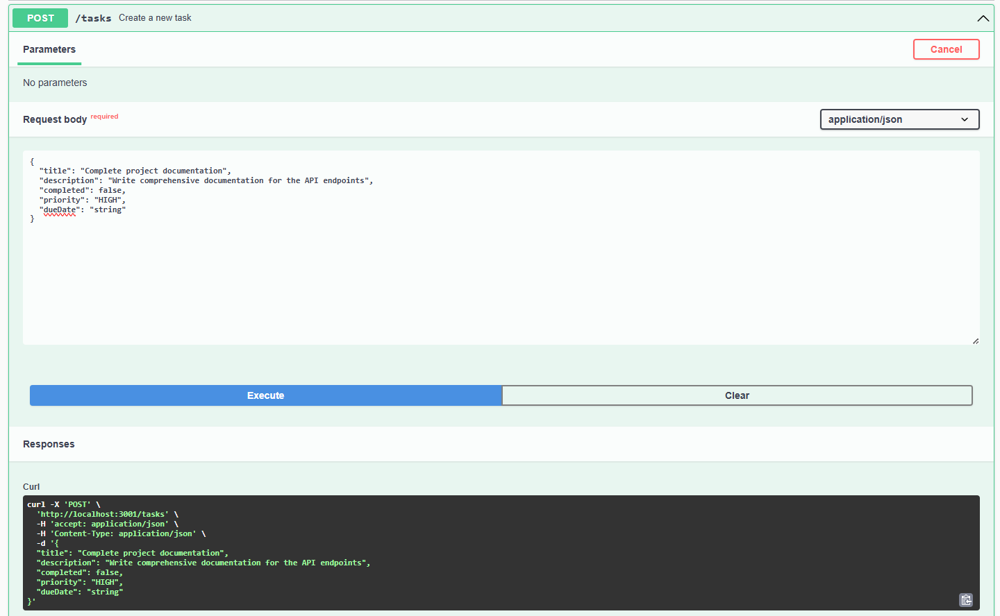
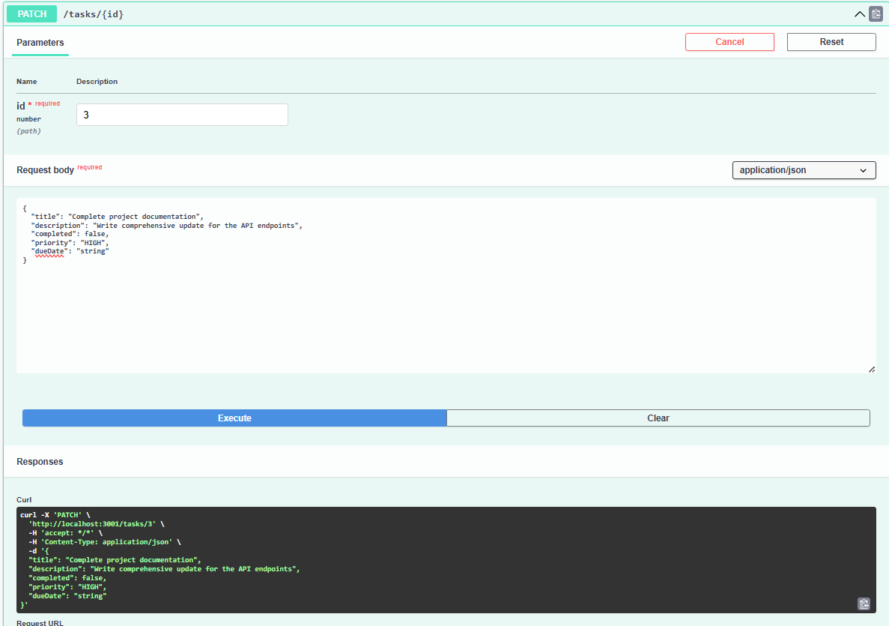
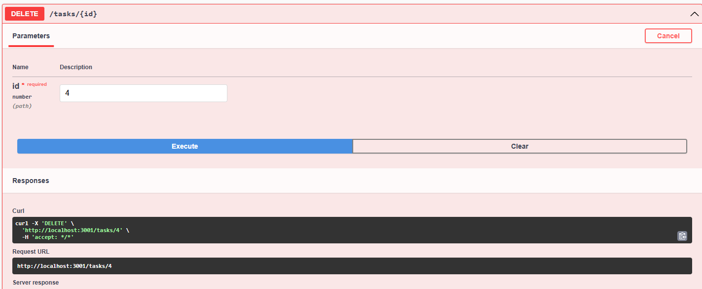

# Activity Document: Task Manager Application

---

## Title of Activity
**Full-Stack Task Manager with React.js and NestJS**

---

## Short Description

The Task Manager is a comprehensive full-stack web application that allows users to efficiently organize and manage their daily tasks. The application provides a modern, intuitive interface for creating, viewing, updating, and deleting tasks with additional features like priority levels, due dates, and completion tracking.

### What the App Does:
- **Task Management**: Users can create new tasks with titles, descriptions, priority levels, and due dates
- **Task Organization**: Filter tasks by status (All, Active, Completed) for better organization
- **Task Operations**: Complete CRUD operations - Create, Read, Update, and Delete tasks
- **Status Tracking**: Mark tasks as complete or incomplete with visual indicators
- **Priority System**: Assign priority levels (Low, Medium, High) with color-coded badges
- **Due Date Management**: Set and track due dates for tasks
- **Real-time Statistics**: View live counts of total, active, and completed tasks
- **Responsive Design**: Works seamlessly on desktop, tablet, and mobile devices

---

## Technology Stack

### Frontend
- **React.js 18** - Modern JavaScript library for building user interfaces
- **TypeScript** - Type-safe JavaScript for better development experience
- **CSS3** - Modern styling with gradients, animations, and responsive design
- **Axios** - HTTP client for API communication
- **date-fns** - Date formatting and manipulation library

### Backend
- **NestJS** - Progressive Node.js framework for building scalable server-side applications
- **TypeScript** - Strongly typed programming language
- **Node.js** - JavaScript runtime environment
- **TypeORM** - Object-Relational Mapping for database operations
- **MySQL** - Relational database management system
- **class-validator** - Decorator-based validation for DTOs

---

## Instructions on How to Run the Project

### Prerequisites
Before running the project, ensure you have the following installed:
- **Node.js** (version 16 or higher)
- **MySQL Server** (version 8.0 or higher)
- **npm** or **yarn** package manager

### Step 1: Database Setup

1. **Install MySQL Server** if not already installed
2. **Start MySQL Service**
3. **Create Database**:
   ```sql
   CREATE DATABASE taskmanager;
   ```
4. **Note your MySQL credentials** (username, password, port)

### Step 2: Backend Setup

1. **Navigate to Backend Directory**:
   ```bash
   cd Act1-Todolist/backend
   ```

2. **Install Dependencies**:
   ```bash
   npm install
   ```

3. **Configure Environment Variables**:
   Create a `.env` file in the backend directory with the following content:
   ```env
   DB_HOST=localhost
   DB_PORT=3306
   DB_USERNAME=root
   DB_PASSWORD=your_mysql_password
   DB_NAME=taskmanager
   PORT=3001
   ```
   Replace `your_mysql_password` with your actual MySQL password.

4. **Start Backend Server**:
   ```bash
   npm run start:dev
   ```
   
   The backend API will be available at `http://localhost:3001`
   
   **Success Indicators**:
   - Console shows "Task Manager Backend running on port 3001"
   - Database tables are automatically created
   - No error messages in the console

### Step 3: Frontend Setup

1. **Open New Terminal Window**
2. **Navigate to Frontend Directory**:
   ```bash
   cd Act1-Todolist/frontend
   ```

3. **Install Dependencies**:
   ```bash
   npm install
   ```

4. **Start Frontend Development Server**:
   ```bash
   npm start
   ```
   
   The application will automatically open in your browser at `http://localhost:3000`

### Step 4: Using the Application

1. **Access the Application**:
   Open your web browser and go to `http://localhost:3000`

2. **Add Your First Task**:
   - Click the "Add Task" button
   - Fill in the task details (title is required)
   - Select priority level and due date (optional)
   - Click "Add Task" to save

3. **Manage Tasks**:
   - **Complete Tasks**: Click the checkbox next to any task
   - **Edit Tasks**: Click the edit button (✏️) to modify task details
   - **Delete Tasks**: Click the delete button (🗑️) to remove tasks
   - **Filter Tasks**: Use the filter tabs (All, Active, Completed)

4. **View Statistics**:
   - Monitor task counts in the statistics bar
   - Track your productivity with completion rates

---

## Project Features

### Core Functionality
- ✅ **Create Tasks**: Add new tasks with comprehensive details
- ✅ **View Tasks**: Display all tasks in an organized, filterable list
- ✅ **Update Tasks**: Edit existing task information
- ✅ **Delete Tasks**: Remove tasks with confirmation
- ✅ **Toggle Completion**: Mark tasks as complete or incomplete

### Advanced Features
- ✅ **Priority Levels**: Assign and display task priorities with color coding
- ✅ **Due Dates**: Set and track task deadlines
- ✅ **Filtering**: View tasks by completion status
- ✅ **Real-time Statistics**: Live updates of task counts
- ✅ **Responsive Design**: Mobile-friendly interface
- ✅ **Form Validation**: Client and server-side validation
- ✅ **Error Handling**: Graceful error management and user feedback

### Technical Features
- ✅ **RESTful API**: Well-structured backend API
- ✅ **Type Safety**: Full TypeScript implementation
- ✅ **Database Integration**: Persistent data storage with MySQL
- ✅ **CORS Support**: Cross-origin resource sharing enabled
- ✅ **Modern UI**: Beautiful, intuitive user interface

---

## API Endpoints

| Method | Endpoint | Description |
|--------|----------|-------------|
| GET | `/tasks` | Retrieve all tasks |
| GET | `/tasks/:id` | Retrieve specific task |
| POST | `/tasks` | Create new task |
| PATCH | `/tasks/:id` | Update existing task |
| PATCH | `/tasks/:id/toggle` | Toggle task completion |
| DELETE | `/tasks/:id` | Delete task |

### API Testing 

**GET /tasks - Retrieve All Tasks**


*Response showing all tasks retrieved from the database*

**POST /tasks - Create New Task**


*Creating a new task with title, description, priority, and due date*

**PATCH /tasks/:id - Update Task**


*Updating an existing task's information*

**DELETE /tasks/:id - Delete Task**


*Deleting a task from the database*

---

## Troubleshooting

### Common Issues and Solutions

1. **Backend Won't Start**:
   - Check if MySQL server is running
   - Verify database credentials in `.env` file
   - Ensure port 3001 is not in use

2. **Frontend Can't Connect to Backend**:
   - Confirm backend is running on port 3001
   - Check browser console for CORS errors
   - Verify API URLs in frontend service

3. **Database Connection Errors**:
   - Confirm MySQL service is active
   - Check database name exists
   - Verify username and password

4. **Port Conflicts**:
   - Change backend port in `.env` file
   - Update frontend proxy configuration if needed

---

## Project Structure

```
Act1-Todolist/
├── backend/                 # NestJS Backend API
│   ├── src/
│   │   ├── tasks/          # Task module
│   │   │   ├── dto/        # Data Transfer Objects
│   │   │   ├── entities/   # Database entities
│   │   │   ├── tasks.controller.ts
│   │   │   ├── tasks.service.ts
│   │   │   └── tasks.module.ts
│   │   ├── app.module.ts
│   │   └── main.ts
│   └── package.json
├── frontend/               # React.js Frontend
│   ├── src/
│   │   ├── components/     # React components
│   │   ├── services/       # API services
│   │   ├── types/          # TypeScript types
│   │   ├── App.tsx
│   │   └── App.css
│   └── package.json
└── README.md
```

---

## Educational Objectives

This project demonstrates:
- **Full-stack Development**: Complete application from database to user interface
- **Modern Web Technologies**: Current industry-standard tools and frameworks
- **API Design**: RESTful service architecture
- **Database Integration**: ORM usage and database design
- **Type Safety**: TypeScript implementation across the stack
- **User Experience**: Modern UI/UX design principles
- **Error Handling**: Robust error management strategies
- **Responsive Design**: Mobile-first development approach

---

## Conclusion

The Task Manager application showcases a complete full-stack development workflow using modern technologies. It provides practical experience with React.js for frontend development, NestJS for backend API creation, and MySQL for data persistence. The application is production-ready with proper error handling, validation, and a responsive user interface.

The project serves as an excellent foundation for understanding full-stack development principles and can be extended with additional features such as user authentication, task sharing, notifications, and more advanced filtering options.

---

**Note**: To convert this document to .docx format, you can:
1. Copy the content to Microsoft Word
2. Use online markdown to Word converters
3. Use tools like Pandoc: `pandoc Activity-Document.md -o Activity-Document.docx`
