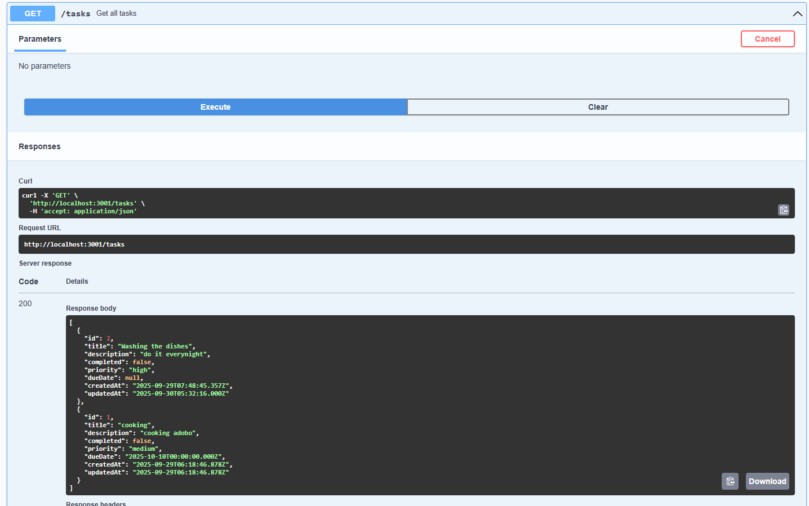
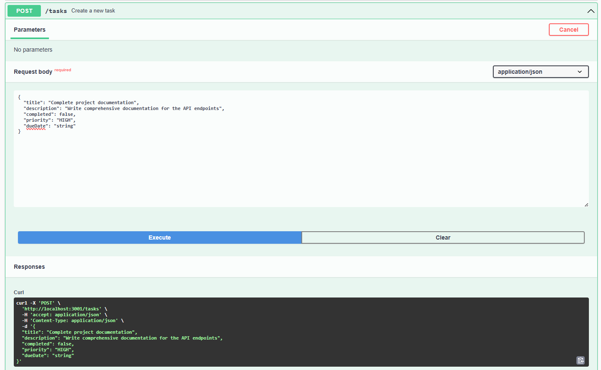
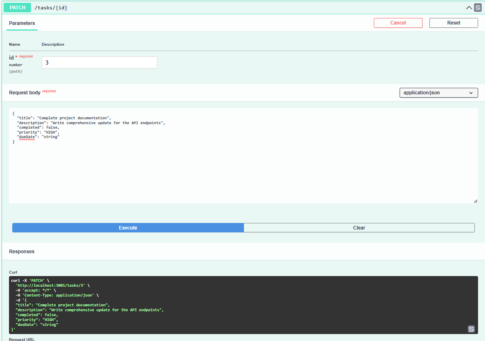
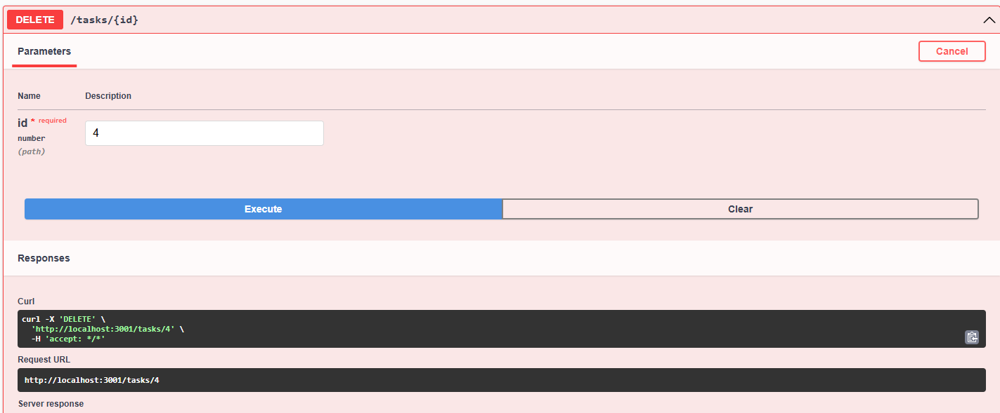

# Task Manager Application

A comprehensive full-stack task management application built with React.js frontend and NestJS backend, featuring TypeScript and MySQL database integration.

---

## 📋 Table of Contents

- [Overview](#overview)
- [Features](#features)
- [Technology Stack](#technology-stack)
- [Prerequisites](#prerequisites)
- [Installation & Setup](#installation--setup)
- [Usage](#usage)
- [API Endpoints](#api-endpoints)
- [Project Structure](#project-structure)
- [Development](#development)
- [Troubleshooting](#troubleshooting)
- [Deployment](#deployment)

---

## 🎯 Overview

The Task Manager is a comprehensive full-stack web application that allows users to efficiently organize and manage their daily tasks. The application provides a modern, intuitive interface for creating, viewing, updating, and deleting tasks with additional features like priority levels, due dates, and completion tracking.

### What the App Does:
- **Task Management**: Create new tasks with titles, descriptions, priority levels, and due dates
- **Task Organization**: Filter tasks by status (All, Active, Completed) for better organization
- **Task Operations**: Complete CRUD operations - Create, Read, Update, and Delete tasks
- **Status Tracking**: Mark tasks as complete or incomplete with visual indicators
- **Priority System**: Assign priority levels (Low, Medium, High) with color-coded badges
- **Due Date Management**: Set and track due dates for tasks
- **Real-time Statistics**: View live counts of total, active, and completed tasks
- **Responsive Design**: Works seamlessly on desktop, tablet, and mobile devices

---

## ✨ Features

### Core Functionality
- ✅ **Create Tasks**: Add new tasks with comprehensive details (title, description, priority, due date)
- ✅ **View Tasks**: Display all tasks in an organized, filterable list
- ✅ **Update Tasks**: Edit existing task information
- ✅ **Delete Tasks**: Remove tasks with confirmation
- ✅ **Toggle Completion**: Mark tasks as complete or incomplete

### Advanced Features
- ✅ **Priority Levels**: Assign and display task priorities (Low, Medium, High) with color coding
- ✅ **Due Dates**: Set and track task deadlines
- ✅ **Filtering**: View tasks by completion status (All, Active, Completed)
- ✅ **Real-time Statistics**: Live updates of total, active, and completed task counts
- ✅ **Responsive Design**: Mobile-friendly interface that works on all devices
- ✅ **Form Validation**: Client and server-side validation
- ✅ **Error Handling**: Graceful error management and user feedback

### Technical Features
- ✅ **RESTful API**: Well-structured backend API with full CRUD operations
- ✅ **Type Safety**: Full TypeScript implementation across frontend and backend
- ✅ **Database Integration**: Persistent data storage with MySQL and TypeORM
- ✅ **CORS Support**: Cross-origin resource sharing enabled
- ✅ **Modern UI**: Beautiful, intuitive user interface with gradients and animations

---

## 🛠️ Technology Stack

### Frontend
- **React.js 18** - Modern JavaScript library for building user interfaces
- **TypeScript** - Type-safe JavaScript for better development experience
- **CSS3** - Modern styling with gradients, animations, and responsive design
- **Axios** - HTTP client for API communication
- **date-fns** - Date formatting and manipulation library

### Backend
- **NestJS** - Progressive Node.js framework for building scalable server-side applications
- **TypeScript** - Strongly typed programming language
- **Node.js** - JavaScript runtime environment
- **TypeORM** - Object-Relational Mapping for database operations
- **MySQL** - Relational database management system
- **class-validator** - Decorator-based validation for DTOs

---

## 📦 Prerequisites

Before running the project, ensure you have the following installed:
- **Node.js** (version 16 or higher)
- **MySQL Server** (version 8.0 or higher)
- **npm** or **yarn** package manager

---

## 🚀 Installation & Setup

### Step 1: Database Setup

1. **Install MySQL Server** if not already installed
2. **Start MySQL Service**
3. **Create Database**:
   ```sql
   CREATE DATABASE taskmanager;
   ```
4. **Note your MySQL credentials** (username, password, port)

### Step 2: Backend Setup

1. **Navigate to Backend Directory**:
   ```bash
   cd Act1-Todolist/backend
   ```

2. **Install Dependencies**:
   ```bash
   npm install
   ```

3. **Configure Environment Variables**:
   
   Create a `.env` file in the backend directory with the following content:
   ```env
   DB_HOST=localhost
   DB_PORT=3306
   DB_USERNAME=root
   DB_PASSWORD=your_mysql_password
   DB_NAME=taskmanager
   PORT=3001
   ```
   Replace `your_mysql_password` with your actual MySQL password.

4. **Start Backend Server**:
   ```bash
   npm run start:dev
   ```
   
   The backend API will be available at `http://localhost:3001`
   
   **Success Indicators**:
   - Console shows "Task Manager Backend running on port 3001"
   - Database tables are automatically created
   - No error messages in the console

### Step 3: Frontend Setup

1. **Open New Terminal Window**

2. **Navigate to Frontend Directory**:
   ```bash
   cd Act1-Todolist/frontend
   ```

3. **Install Dependencies**:
   ```bash
   npm install
   ```

4. **Start Frontend Development Server**:
   ```bash
   npm start
   ```
   
   The application will automatically open in your browser at `http://localhost:3000`

---

## 📖 Usage

### Getting Started

1. **Access the Application**:
   
   Open your web browser and go to `http://localhost:3000`

2. **Add Your First Task**:
   - Click the "Add Task" button
   - Fill in the task details (title is required)
   - Select priority level and due date (optional)
   - Click "Add Task" to save

3. **Manage Tasks**:
   - **Complete Tasks**: Click the checkbox next to any task
   - **Edit Tasks**: Click the edit button (✏️) to modify task details
   - **Delete Tasks**: Click the delete button (🗑️) to remove tasks
   - **Filter Tasks**: Use the filter tabs (All, Active, Completed)

4. **View Statistics**:
   - Monitor task counts in the statistics bar
   - Track your productivity with completion rates

---

## 🔌 API Endpoints

### Task Operations

| Method | Endpoint | Description |
|--------|----------|-------------|
| GET | `/tasks` | Retrieve all tasks |
| GET | `/tasks/:id` | Retrieve specific task by ID |
| POST | `/tasks` | Create new task |
| PATCH | `/tasks/:id` | Update existing task |
| PATCH | `/tasks/:id/toggle` | Toggle task completion status |
| DELETE | `/tasks/:id` | Delete task |

### Task Schema

```typescript
{
  id: number;
  title: string;
  description?: string;
  completed: boolean;
  priority?: string; // 'low' | 'medium' | 'high'
  dueDate?: string;
  createdAt: string;
  updatedAt: string;
}
```

### API Testing Examples

**GET /tasks - Retrieve All Tasks**



*Example response showing all tasks retrieved from the database*

---

**POST /tasks - Create New Task**



*Creating a new task with title, description, priority, and due date*

---

**PATCH /tasks/:id - Update Task**



*Updating an existing task's information*

---

**DELETE /tasks/:id - Delete Task**



*Deleting a task from the database*

---

## 📁 Project Structure

```
Act1-Todolist/
├── backend/                      # NestJS Backend API
│   ├── src/
│   │   ├── tasks/               # Task module
│   │   │   ├── dto/             # Data Transfer Objects
│   │   │   │   ├── create-task.dto.ts
│   │   │   │   └── update-task.dto.ts
│   │   │   ├── entities/        # Database entities
│   │   │   │   └── task.entity.ts
│   │   │   ├── tasks.controller.ts
│   │   │   ├── tasks.service.ts
│   │   │   └── tasks.module.ts
│   │   ├── app.module.ts
│   │   └── main.ts
│   ├── package.json
│   ├── tsconfig.json
│   └── nest-cli.json
├── frontend/                     # React.js Frontend
│   ├── src/
│   │   ├── components/          # React components
│   │   │   ├── TaskForm.tsx
│   │   │   ├── TaskItem.tsx
│   │   │   └── TaskList.tsx
│   │   ├── services/            # API services
│   │   │   └── taskService.ts
│   │   ├── types/               # TypeScript types
│   │   │   └── Task.ts
│   │   ├── App.tsx
│   │   ├── App.css
│   │   ├── index.tsx
│   │   └── index.css
│   ├── public/
│   │   └── index.html
│   ├── package.json
│   └── tsconfig.json
├── images/                       # Screenshots and documentation images
└── README.md
```

---

## 💻 Development

### Backend Development Commands

```bash
cd backend
npm run start:dev   # Start in development mode with hot reload
npm run build       # Build for production
npm run start:prod  # Start in production mode
npm run lint        # Lint code
npm run test        # Run tests
```

### Frontend Development Commands

```bash
cd frontend
npm start           # Start development server
npm run build       # Build for production
npm test            # Run tests
npm run eject       # Eject from Create React App (one-way operation)
```

---

## 🔧 Troubleshooting

### Common Issues and Solutions

#### 1. Backend Won't Start
- **Issue**: Backend fails to start or crashes immediately
- **Solutions**:
  - Check if MySQL server is running
  - Verify database credentials in `.env` file
  - Ensure port 3001 is not in use by another application
  - Confirm the database `taskmanager` exists in MySQL

#### 2. Frontend Can't Connect to Backend
- **Issue**: API calls fail or return CORS errors
- **Solutions**:
  - Confirm backend is running on port 3001
  - Check browser console for specific CORS errors
  - Verify API URLs in `taskService.ts`
  - Ensure CORS is properly configured in `main.ts`

#### 3. Database Connection Errors
- **Issue**: "Cannot connect to database" or similar errors
- **Solutions**:
  - Confirm MySQL service is active and running
  - Check database name exists (`taskmanager`)
  - Verify username and password in `.env` file
  - Ensure DB_HOST and DB_PORT are correct

#### 4. Port Conflicts
- **Issue**: "Port already in use" error
- **Solutions**:
  - Change backend port in `.env` file (default: 3001)
  - Change frontend port by setting PORT environment variable
  - Update frontend proxy configuration if backend port changes

#### 5. Dependencies Installation Fails
- **Issue**: npm install fails with errors
- **Solutions**:
  - Clear npm cache: `npm cache clean --force`
  - Delete `node_modules` and `package-lock.json`, then reinstall
  - Ensure Node.js version is 16 or higher
  - Check internet connection for package downloads

---

## 🚢 Deployment

### Backend Deployment

1. **Environment Configuration**:
   - Set `NODE_ENV=production`
   - Configure production database settings
   - Set `synchronize: false` in TypeORM configuration for safety

2. **Build Application**:
   ```bash
   npm run build
   ```

3. **Start Production Server**:
   ```bash
   npm run start:prod
   ```

4. **Recommended Hosting**: Heroku, AWS EC2, DigitalOcean, Railway

### Frontend Deployment

1. **Update API Base URL**:
   - Modify `taskService.ts` to point to production backend URL

2. **Build for Production**:
   ```bash
   npm run build
   ```

3. **Deploy Static Files**:
   - Serve the `build` folder with a web server (Nginx, Apache)
   - Or deploy to platforms like Vercel, Netlify, or AWS S3

4. **Recommended Hosting**: Vercel, Netlify, AWS S3 + CloudFront

### Database Production Setup

1. Use a managed MySQL service (AWS RDS, Google Cloud SQL, PlanetScale)
2. Set up proper backups and monitoring
3. Configure SSL/TLS for secure connections
4. Disable `synchronize` in TypeORM and use migrations instead

---

## 🎓 Educational Objectives

This project demonstrates:
- **Full-stack Development**: Complete application from database to user interface
- **Modern Web Technologies**: Current industry-standard tools and frameworks
- **API Design**: RESTful service architecture and best practices
- **Database Integration**: ORM usage and relational database design
- **Type Safety**: TypeScript implementation across the entire stack
- **User Experience**: Modern UI/UX design principles and responsive design
- **Error Handling**: Robust error management strategies
- **Code Organization**: Modular architecture and separation of concerns

---

## 📝 License

This project is for educational purposes.

---

## 🤝 Contributing

This is an educational project. Feel free to fork and modify for learning purposes.

---

## 📧 Contact

For questions or feedback about this project, please open an issue on the repository.

---

**Built with ❤️ using React.js and NestJS**
